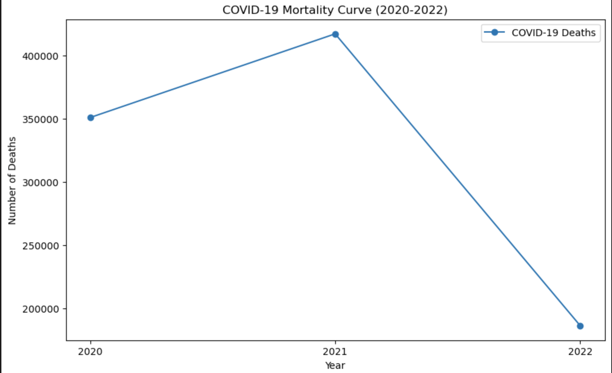
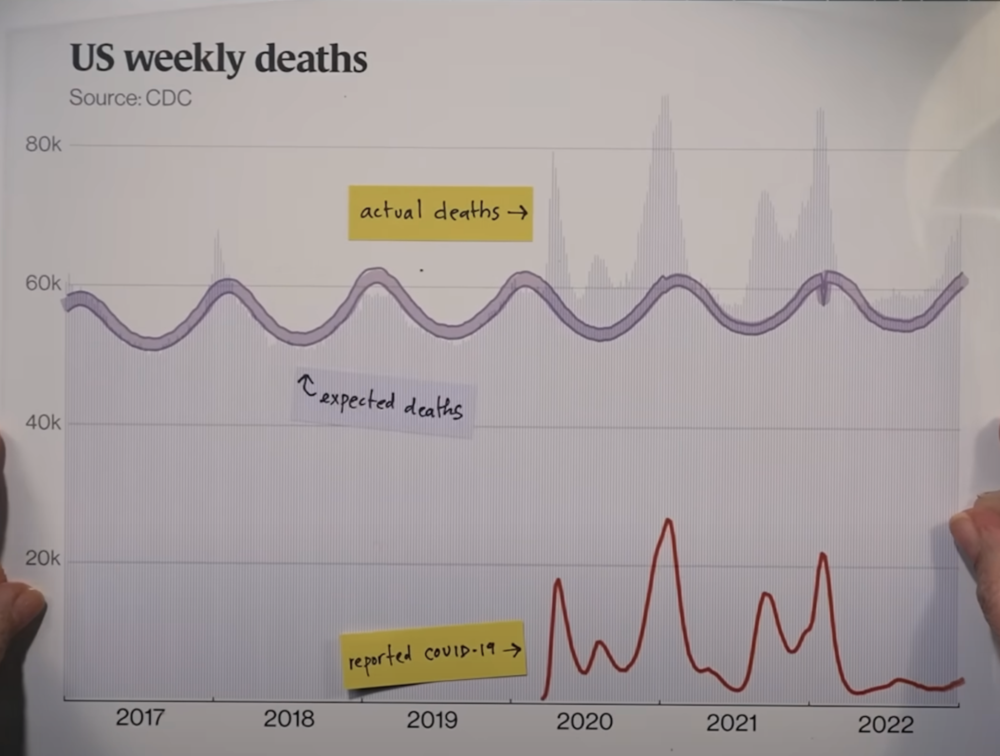
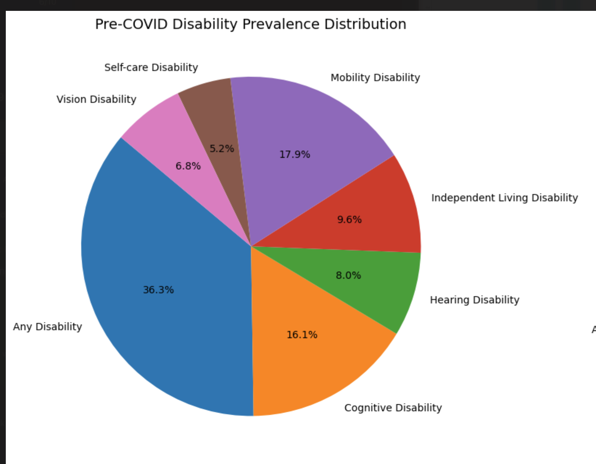
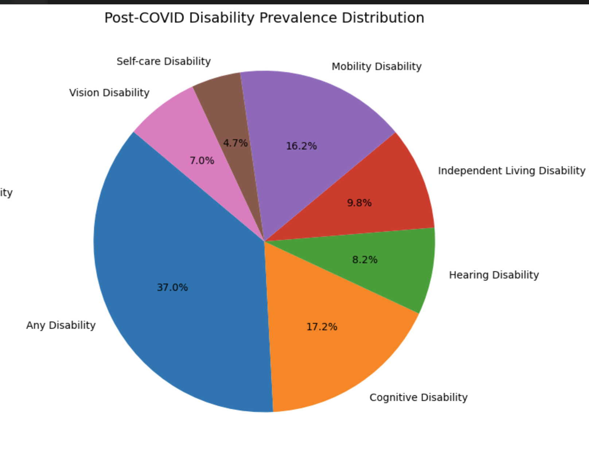
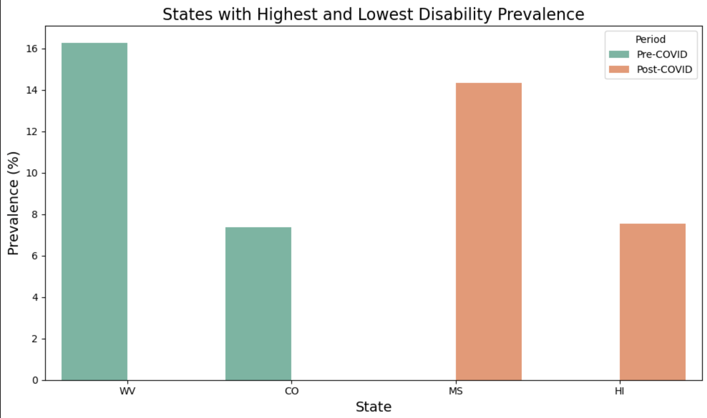

# Plots needed in report / presentation

**IMPORTANT**: 
- We still need to write discussions for each.
- We don't need to include everything below in Homework 9 if it will be too much for the discussions
- For homework 9, all plots below should be non-interactive. Prioritize that first, then once done can work on interactive plots for presentation if we want to.   

## Intro:
> Hi, let's talk about deaths
1. Breakdown of deaths by topic in the US in 2019 **[TODO, @Lakshit]**
> This is the breakdown of death causes in the US in 2019
2. Breakdown of deaths by topic (BUT COVID IS ITS OWN TOPIC) in 2021 **[TODO, @Lakshit]**
> And this is the breakdown of deaths in 2021. So Covid caused a lot of deaths, but unfortunately it doesn't end there. There are many reports of covid causing long term effects ...OUR INTRO...

> So if we want to find Covid's long term effects on other diseases or health metrics, how do we do it? 

> Here's the covid mortality curve: 
3. Covid deaths per year (underlying causes of death) **[In-Progress, need to smooth out the line graph -- maybe use a spline or use 1 datapoint per month rather than per year, @Ponnu]**
   
   
> However, how accurate is that number? There's this analysis by Hank Green and other researchers to find the true number of covid deaths by using excess mortality. We can use the same technique to analyze other diseases or health metrics and see for ourselves whether the reports are accurate
4. Excess mortality curve per year **[TODO, OPTIONAL -- if we don't have this can just show the picture, @Lakshit]**
   

> In this report/presentation, we will analyze these indicators: indicator1, indicator2, indicator3, ...

## CKD indicator:
> CKD is ...We expect CKD indicators to see an increase per report_A and report_B
5. Prevalence comparison + covid curve **[Done, @Devin]**
6. Scatter plot of average changes **[In-progress, change from by topic to by question per plot, @Lakshit]**
> Conclusion: Inconclusive, not enough data (2021)

## COPD indicator:
> COPD is ... We expect COPD indicators to see an increase per report_C and report_D
7. Prevalence comparison + covid curve **[Done, @Devin]**
8. Scatter plot of average changes **[In-progress, change from by topic to by question per plot, @Lakshit]**
> Conclusion: Inconclusive, not enough data (2021)

## Cancer indicator: **[Missing Data, @Lakshit]**
> Cancer is ... We have all types of cancer such as xyz ... We expect Cancer indicators to not change per report_E and report_F
9. Prevalence comparison + covid curve **[Done, @Devin]**
> There doesn't seem to be significant change between pre-and-post covid, here's the scatter plot to summarize
10. Scatter plot of average changes **[In-progress, change from by topic to by question per plot, @Lakshit]**
> Conclusion: This matches current scientific consensus that COVID does not cause cancer

## +1 MORE indicator (???): **[Missing Data, @Devin]**

## Disability: 
11. Percentage of disabled people in the US in 2019 (Pie chart) **[TODO, use only data from 2019, disabled vs not disabled only, @Ponnu]**
> Over a quarter of americans have some form of disability, and here's the breakdown:
12. Breakdown of disability in 2019 (Pie chart) **[In-Progress, use only data from 2019, include all other disability types except for 'Any Disability' or 'No Disability', @Ponnu]**

> Now we will see if Covid has an impact on disability 
13. Prevalence comparison + covid curve **[Done, @Devin]**
> As we can see, there is an increase of ~2.5% of Any Disability, which is roughly 7.5 million of recently-disabled people, and this increase can be mostly explained by cognitive disability
> Here's the average changes per type:
14. Scatter plot of average changes **[In-progress, change from by topic to by question per plot, @Lakshit]**
> And here's that same disability breakdown from earlier but using data from 2022
15. Breakdown of disability in 2022 (Pie chart) **[In-Progress, use only data from 2022, include all other disability types except for 'Any Disability' or 'No Disability', @Ponnu]**

## Deep dive into disability: 
> Now, let's explore the data some more on the state level. 
16. Map of disability rates across US in 2019 **[TODO, @Duong]**

> Let's take the 3 states with highest and lowest disability, each 
17. 3 Highest and 3 lowest states disability in 2019 (Bar Graph) **[In-progress, need to modify the current graph to have 3 of each, and only use 2019 data, @Ponnu]**

> Now let's see which states experienced the biggest increase in disability rate post-covid
18. Map of disability change across US pre-and-post covid (Map Graph) **[TODO, @Duong]**

> Let's take 6 states with the biggest change
19. States with biggest change pre-and-post covid (Bar Graph, sorted by magnitude, but can be positive or negative) **[TODO, @Ponnu]**

> If we take the previous map of disability change, and place the map of vaccination rates next to it, we can see that the states with the biggest increase of disability also tend to have low vaccination rates
20. Previous map of disability change side-by-side with a new map of vaccination rates across US states (2 Map Graphs) **[TODO, @Duong]** 

> We can see that clearer if we take the previous bar plot of the 6 states with the biggest change, and overlay them with their vaccination rates
21. Previous bar graph of 6 states with biggest change + overlay vaccination rates for states with biggest change (Bar Graph) **[TODO, @Ponnu]**

## Vaccine discussion:
> In fact, let's take the covid mortality curve from the beginning, and overlay it with the vaccination rates
22. Covid mortality curve + vaccine **[In-Progress, change from cumulative covid mortality to raw number per month? @Lakshit]**
> We can see a big decrease in covid mortality as vaccination rates picks up. We can also see its effects in the US
23. Map of covid mortality per state side-by-side with previous map of vaccination rates per state **[TODO, @Duong]**

## Conclusion:
- Covid increased disability
- Covid increased the rate of xyz
- We didn't have data to analyze the changes in abc
- Covid doesn't increase the rate of xyz
- Vaccine works
